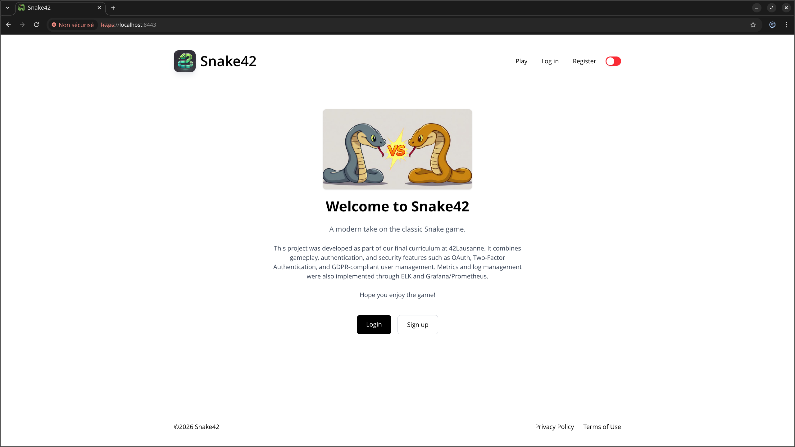
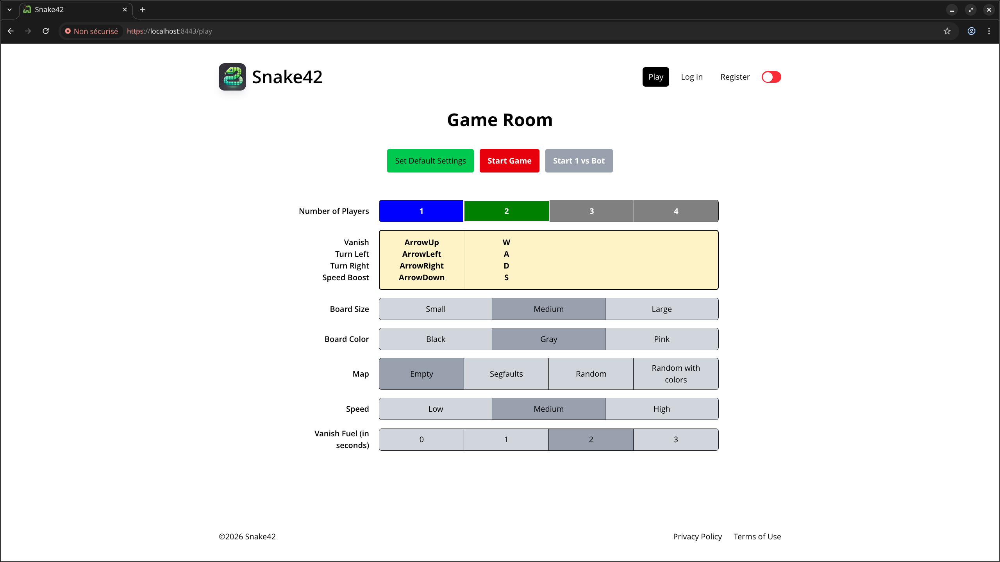
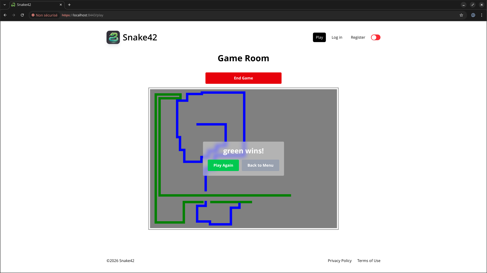
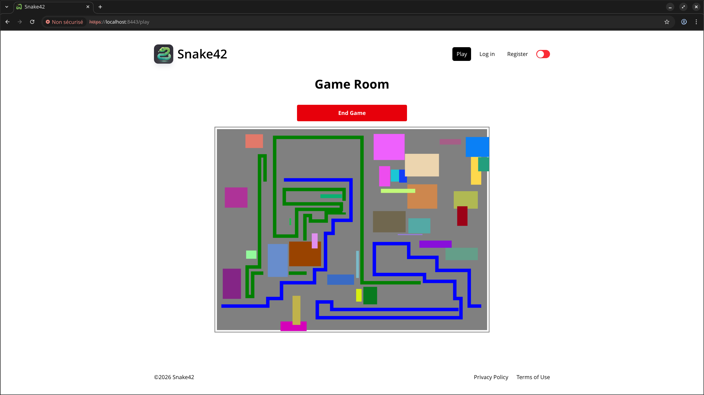
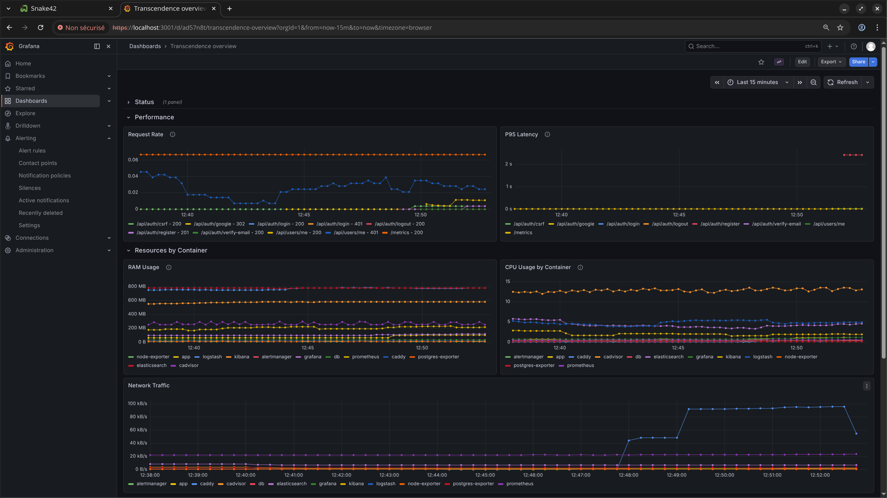
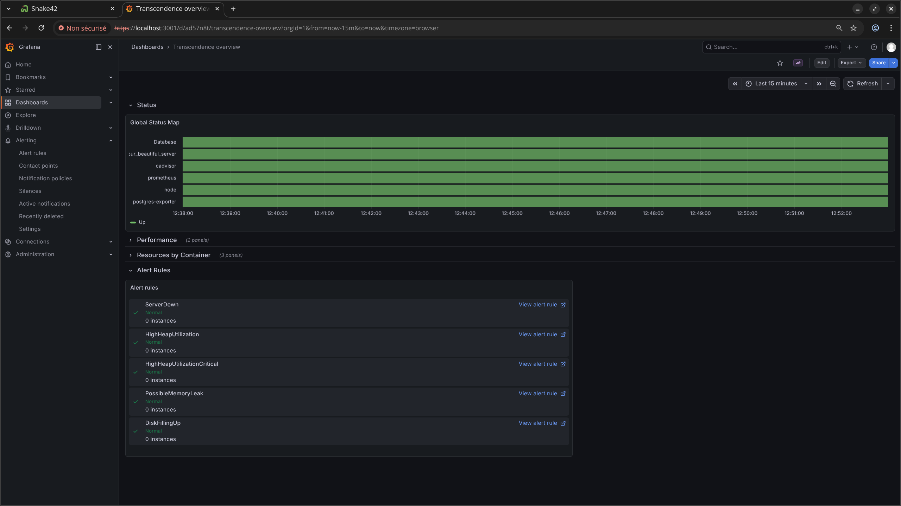

# Hi there
I am Gentian Buqaj, and I am learning to code at 42 Lausanne. I have completed the Common Core, and I plan to pursue RNCP6 certification in web and mobile development and/or RNCP7 certification in web, databases, and AI.

- [linkedin.com/in/gentian-buqaj/](https://www.linkedin.com/in/gentian-buqaj/)
- Discord: bubu_94

### Languages & Tools

 

# Current project: Learn basics of Java

 

# 42 school
https://42lausanne.ch/  
The 42 Network is a globally ranked, tuition-free computer science program with 10,000+ students in 20+ countries. Operating without teachers or traditional classrooms, it uses a peer-to-peer model centered on collaborative project development and a gamified curriculum. Students progress by completing increasingly difficult software engineering challenges and evaluating each other's work, prioritizing self-reliance and practical problem-solving over academic theory. Entry is determined by the "Piscine"—a rigorous, month-long selection process that tests candidates' logic, endurance, and ability to learn in a high-pressure environment.

## 42 Projects

### [ft_transcendence](https://github.com/Ldelahay/Ft_transcendence) - full stack web application
*Collaborators: @Ldelahay, @sidneybaumann.*
* **Description:** Developed a multiplayer game inspired by Curve Fever, with a REST API for game session and data management, secure user account creation and authentication, and application monitoring with usage statistics.
* **Key Tech:** TypeScript, Fastify, PostgreSQL, Prisma, Zod, Argon2, JWT, Docker, Prometheus, Grafana, React, HTML5 Canvas.

	
	

	
	

	
	

### Webserv
*Collaborator: @sidneybaumann*
* **Description:** Developed a custom HTTP/1.1 server from scratch, capable of handling concurrent client requests. Implemented configuration file parsing, socket programming, and CGI execution.
* **Key Tech:** C++, Sockets, `poll()`, Networking, HTTP Protocol.

### Inception
* **Description:** Engineered a multi-container infrastructure using Docker. Orchestrated isolated services for Nginx, MariaDB, and WordPress to create a scalable web environment.
* **Key Tech:** Docker, Docker Compose, Virtualization, System Administration.

### CPP Modules
* **Description:** A series of rigorous technical challenges focused on Mastering C++98. Deep dive into Object-Oriented Programming (OOP) and memory management.
* **Key Tech:** Inheritance, Polymorphism, Templates, Operator Overloading.

### Cub3D
*Collaborator: @sidneybaumann*

* **Description:** Created a 3D graphical engine using raycasting techniques, inspired by *Wolfenstein 3D*. Managed real-time rendering, map parsing, and fluid player movement.
* **Key Tech:** C, Raycasting, MiniLibX (Graphics Library), Trigonometry.

### Minishell
*Collaborator: @Sylvfo*

* **Description:** Co-authored a functional POSIX-compliant shell. Replicated Bash behavior, including command execution, pipes, redirections, and environment variable management.
* **Key Tech:** C, Process Control (`fork`, `execve`), Signal Handling, Lexing/Parsing.

### Philosophers
* **Description:** Solved the "Dining Philosophers" concurrency problem. Focused on thread synchronization and resource sharing to prevent deadlocks and race conditions.
* **Key Tech:** C, Multithreading (pthreads), Mutexes, Concurrency.

### Why learn C?

C provides a technical foundation that many modern languages hide. With no garbage collection or automatic exception handling, it forces a defensive mindset: checking return values, managing memory explicitly, and anticipating failure modes. These habits lead to more stable, production-ready code regardless of the language used later.  
The language itself is small (around 30–50 keywords), which removes much of the abstraction found in higher-level ecosystems. This keeps the focus on algorithms, data structures, and program logic while providing a clear mental model of how software interacts with memory and the CPU.  
Finally, C is often described as the “Latin” of programming languages. As the foundation for languages like C++, Java, and JavaScript, understanding C makes learning many modern languages significantly easier.

 

# Me

## Personality & Mindset

* **Pragmatic Curiosity:** I like to dig "under the hood" to understand the core logic, even when it's unnecessary for the task at hand. But it can distract me from the task, so I have to stop exploring and stay focused on moving forward.
* **Balanced Optimization:** Clarity is a priority, but I also care about performance and efficiency. I try to find the right balance between the two.
* **Independent & Collaborative**: I enjoy taking ownership of tasks and driving them forward, while staying aligned with the team.
* **Iterative Troubleshooter:** I genuinely enjoy the hunt for bugs and edge cases—especially the ones I accidentally created myself.
* **Calm & Resilient:** Calm under pressure. I've worried enough to know that it's pointless. Now, high-stress environments and complex failures don't faze me; they just provide more data and experience.

## My approach of AI
Using AI to write code can make production faster and easier, but it doesn’t replace the experience of writing code yourself. When I rely on AI, I often understand the resulting code, but I haven’t truly learned it—because practice is the most important part of learning. In this sense, overusing AI can create a form of “knowledge debt” or opportunity cost.  
When learning a new language, I avoid using AI to generate my own code. I only use it to clarify complex concepts. Writing code myself takes more time, but I see it as an investment in deeper understanding. Once I’ve mastered the tools and concepts, using AI to produce code becomes less risky, because I can review and understand what it generates.  
For me, AI is a personal choice for each developer. I currently prioritize deep learning and hands-on coding, but in contexts where speed is essential or when I am not an expert, I am open to using AI to accelerate production — as I did here to help me write this profile, since English is not my first language.

## Experience before coding
Before transitioning into software development, I worked as a delivery driver, order picker, and manual laborer, and I completed mandatory Swiss military service. These roles helped me build a strong professional foundation that I now apply to programming:
- Reliable with a strong sense of responsibility
- Disciplined and detail-oriented
- Able to work efficiently under pressure and handle fatigue
- Adaptable to new environments and challenges
- Strong work ethic and consistency
- Team player with good communication skills
- Autonomous and self-driven
- Organized with a focus on execution and efficiency

This list is a bit generic. More specifically:
- When working on a task, I always try to complete it with as little time and effort as possible.
- When dealing with an angry client, the best way to handle the situation is to remain silent and listen.
- I developed a dislike for repetitive and non-stimulating tasks, which is why I am so excited about coding and automation.